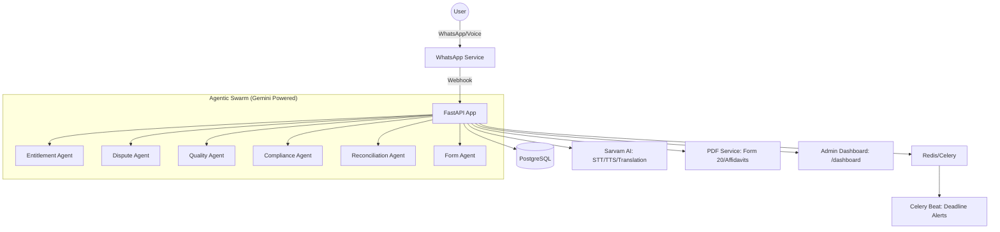

# GhostWriter AI (Haqdaar)

> Empowering Indian families to navigate the complex post-death claims process with a WhatsApp-first, multilingual agentic AI system.

---

## Overview

GhostWriter AI (also known as Haqdaar) is a specialized agentic system designed to simplify the task of filing post-death claims for Indian families. Dealing with the loss of a loved one is hard enough; navigating the bureaucracy of EPF, insurance, and government schemes should not be.

The system provides a seamless, empathetic interface via WhatsApp, supporting multiple Indian languages through voice and text. It uses a swarm of specialized AI agents to discover entitlements, analyze document quality, audit for compliance, and generate real claim forms automatically.

---

## Project Status

| Feature | Status | Notes |
| :--- | :--- | :--- |
| Entitlement Agent | Functional | Core discovery logic active (EPF, State Schemes) |
| Dispute Agent | Functional | Objection letter drafting active |
| Quality Agent | Functional | Document clarity and type detection |
| Compliance Agent | Functional | 100-point audit scoring |
| Reconciliation Agent | Functional | Identity mismatch analysis and affidavit generation |
| PDF Generation | Functional | Automatic EPF Form 20 and Claim Letter |
| Admin Dashboard UI | Functional | Live case tracking at `/dashboard` |
| Voice Notes (TTS) | Functional | OGG Opus conversion for WhatsApp delivery |
| PostgreSQL Persistence | Functional | Full state machine persistence |
| Celery Alerts | Functional | Daily 9 AM IST deadline notifications |

---

## The Agentic Swarm

GhostWriter AI is powered by a team of specialized agents, each focused on a critical part of the claims lifecycle:

- **Entitlement Agent**: Analyzes user demographics and employment history to discover eligible government and private schemes.
- **Dispute Agent**: When a claim is denied, analyzes the denial letter and drafts precise, legal-grade objection letters.
- **Quality Agent**: Assesses the quality of uploaded documents to ensure they are legible and complete.
- **Compliance Agent**: Runs a 100-point audit on family data, automatically triggering form generation once all criteria are met.
- **Reconciliation Agent**: Detects identity mismatches (e.g., Aadhaar vs. Death Certificate) and drafts "One-and-the-Same" person affidavits.
- **Form Agent**: Maps collected family data to official templates (like EPF Form 20) and generates ready-to-submit PDFs.

### Multilingual WhatsApp First

- **Native Language Support**: Full support for Hindi, Telugu, and English.
- **Voice Interaction**: Send voice notes and receive audio responses (transcoded to OGG Opus for WhatsApp playback).
- **Automatic Deadlines**: Daily reminders about claim deadlines (30 days / 7 days / 24 hours) via Celery Beat.

---

## Tech Stack

- **Backend**: FastAPI (Python)
- **LLM and Reasoning**: Google Gemini 2.5 Flash
- **STT / TTS / Translation**: Sarvam AI (optimized for Indian languages)
- **Database**: PostgreSQL (Async SQLAlchemy)
- **Task Queue**: Redis and Celery
- **Document Generation**: ReportLab (PDF generation)
- **Audio**: pydub and FFmpeg (WAV to OGG Opus)
- **Dashboard**: Jinja2 and Tailwind CSS

---

## Architecture



---

## Getting Started

### Prerequisites

- Docker and Docker Compose
- FFmpeg (included in Dockerfile)
- API keys for Gemini, Sarvam, and Meta WhatsApp Business

### Setup and Run

1. **Clone the repository**:
    ```bash
    git clone https://github.com/vaibhavnagdeo18/ghostwriter.git
    cd ghostwriter
    ```

2. **Configure environment**: Create a `.env` file in the project root with the following variables:
    ```
    GOOGLE_API_KEY=
    SARVAM_API_KEY=
    WHATSAPP_ACCESS_TOKEN=
    WHATSAPP_PHONE_NUMBER_ID=
    DATABASE_URL=
    REDIS_URL=
    ```

3. **Start the system**:
    ```bash
    docker-compose up --build
    ```

4. **Simulate a journey**:
    ```bash
    ./demo_test.sh
    ```
    This script simulates a full user journey from onboarding to PDF generation.

5. **Monitor cases**: Visit `http://localhost:8000/dashboard` to view live case statuses and compliance scores.

---

## Project Structure

```
ghostwriter/
├── main.py                  # Entry point, API webhooks, and state machine
├── agents/                  # Specialized Gemini-powered agents
├── core/                    # Database, Celery, and app configuration
├── services/                # WhatsApp, Sarvam, Gemini, and PDF services
├── models/                  # SQLAlchemy database models
├── migrations/              # Alembic database migrations
├── templates/               # Jinja2 dashboard templates
├── data/                    # Scheme definitions and form templates
├── demo_test.sh             # End-to-end integration test script
└── docker-compose.yml       # Infrastructure orchestration
```

---

## License

This project is licensed under the MIT License.
